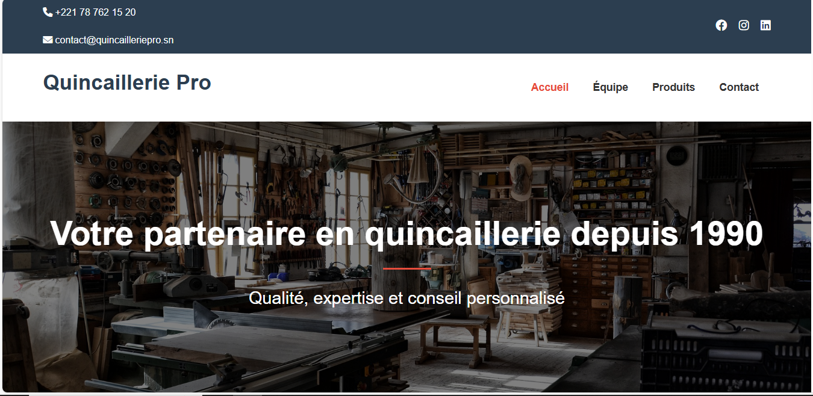
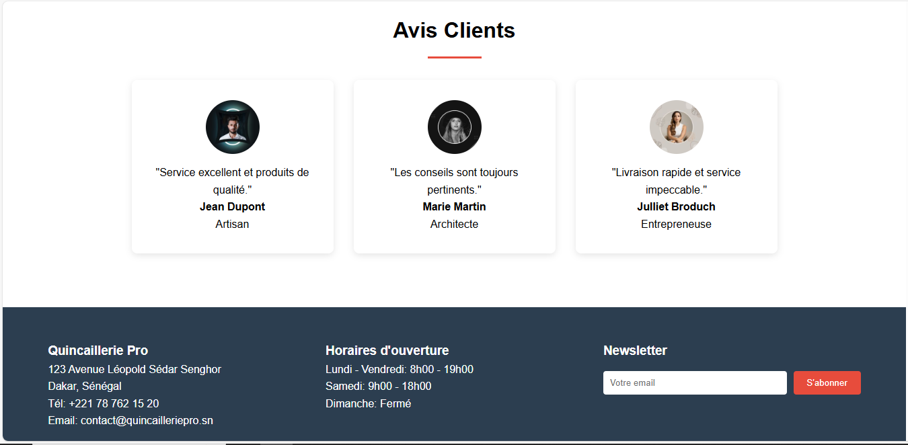
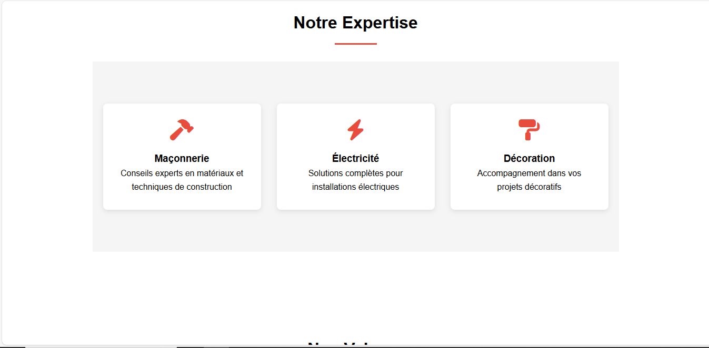
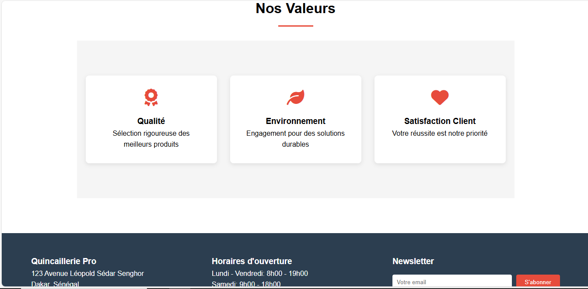
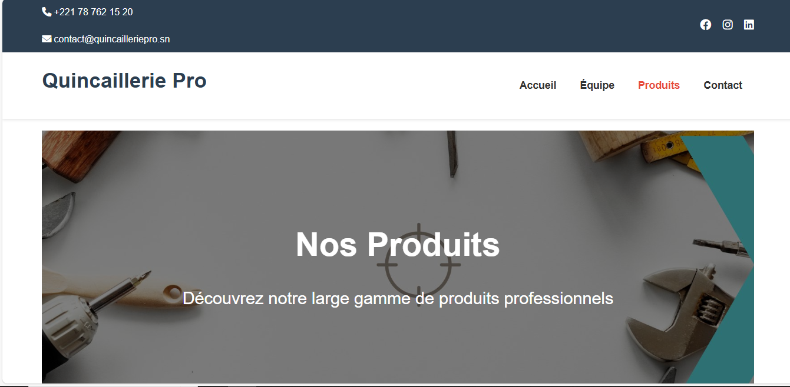
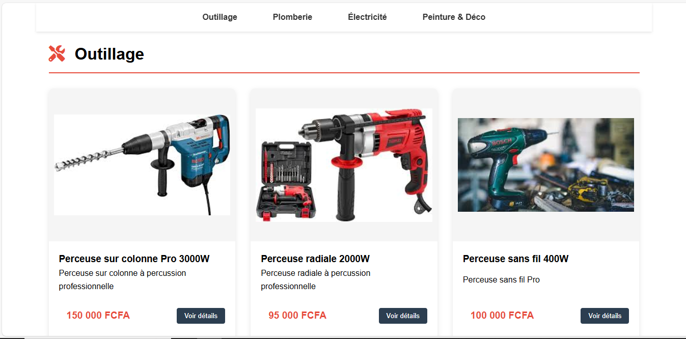
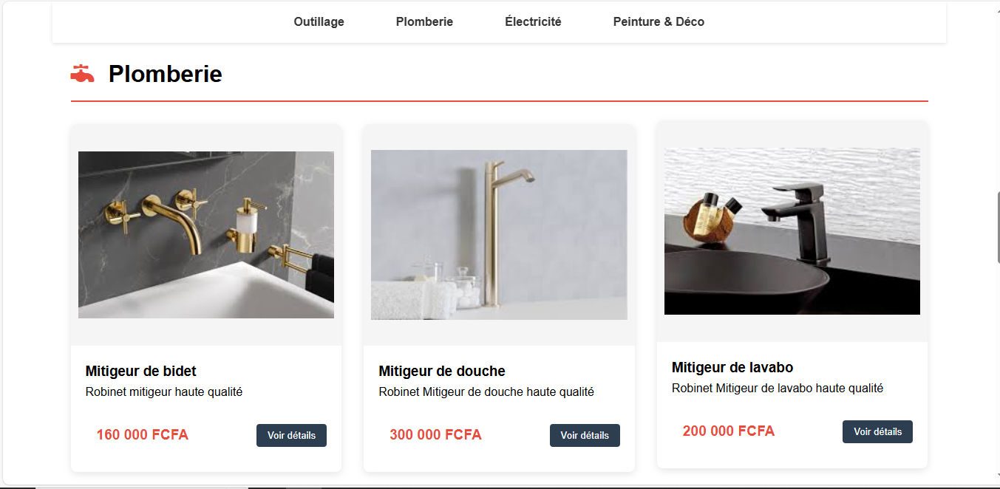
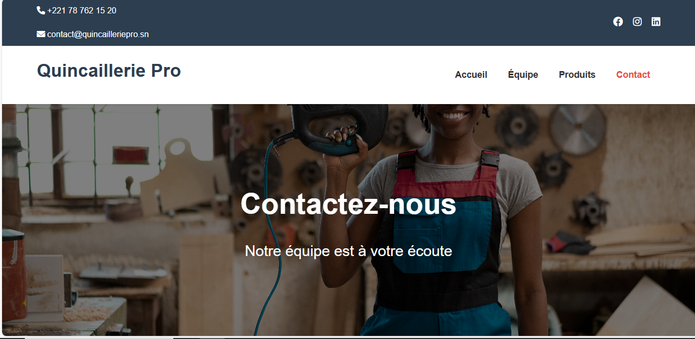
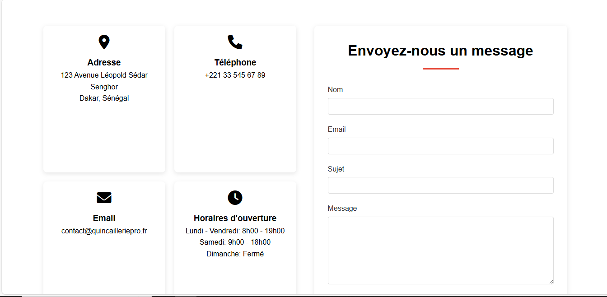
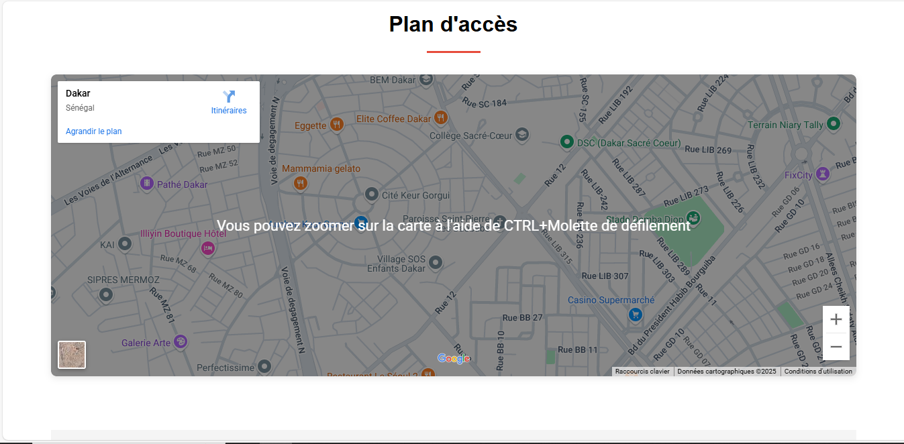

# 🔨 Quincaillerie Pro - Site Web

Un site web vitrine professionnel pour une quincaillerie basée au Sénégal, présentant les produits, l'équipe et les services proposés.

## 📋 Pages du site

1. **Accueil (index.html)**
   - Section hero avec présentation
   - Services proposés
   - Produits phares
   - Témoignages clients

2. **Équipe (equipe.html)**
   - Présentation de l'équipe
   - Mot de la gérante
   - Expertise et compétences
   - Valeurs de l'entreprise

3. **Produits (produits.html)**
   - Catégories de produits
   - Navigation par sections
   - Fiches produits détaillées
   - Outillage, plomberie, électricité, peinture

4. **Contact (contact.html)**
   - Formulaire de contact
   - Informations de contact
   - Plan d'accès Google Maps
   - Liens réseaux sociaux

## ✨ Fonctionnalités

- 🏠 Page d'accueil avec présentation de l'entreprise
- 👥 Présentation de l'équipe et de ses compétences
- 🛒 Catalogue de produits organisé par catégories
- 📱 Design responsive adapté à tous les appareils
- 📍 Informations de contact et carte d'emplacement
- 🔗 Intégration des réseaux sociaux

## 🚀 Fonctionnalités techniques

- ✅ Design responsive
- ✅ Navigation fluide
- ✅ Sections interactives
- ✅ Formulaires de contact
- ✅ Intégration de carte
- ✅ Animations CSS

## 🛠️ Technologies utilisées

- 📄 HTML5
- 🎨 CSS3 (Flexbox & Grid)
- 🔤 Google Fonts (Poppins)
- 📦 Font Awesome 6.0.0
- 🗺️ Google Maps Embed API

## 📁 Structure du projet
Projet/ 
├── css/ 
│ └── style.css # Styles principaux 
│ ├── img/ 
│ ├── backgrounds/ # Images d'arrière-plan 
│ │ ├── hero-bg.jpg # Arrière-plan page d'accueil 
│ │ ├── team-bg.jpg # Arrière-plan page équipe 
│ │ ├── contact-bg.jpg # Arrière-plan page contact 
│ │ └── products-bg.jpg # Arrière-plan page produits │ │ 
│ ├── products/ # Images des produits 
│ │ ├── perceuse-pro1.jpg 
│ │ ├── perceuse-pro2.jpg 
│ │ ├── perceuse-pro3.jpg 
│ │ ├── robinet1.jpg 
│ │ ├── robinet2.jpg 
│ │ ├── robinet3.jpg 
│ │ ├── cable1.jpg 
│ │ ├── cable2.jpg 
│ │ ├── cable3.jpg 
│ │ ├── peinture1.jpg 
│ │ ├── peinture2.jpg 
│ │ └── peinture3.jpg 
│ ├── team/ # Photos de l'équipe 
│ │ ├── gerant.jpg # Photo de la gérante 
│ │ ├── conseiller1.jpg 
│ │ ├── conseiller2.jpg 
│ │ └── livreur.jpg 
│ │ # Images vitrine page d'accueil
│ ├── perceuse.jpg  
│ ├── visseuse.jpg 
│ ├── toolbox.jpg 
│ ├── marteau.jpg 
│ │ # Images des témoignages 
│ ├── client1.jpg 
│ ├── client2.jpg 
│ └── client3.jpg 
│ ├── index.html # Page d'accueil 
├── equipe.html # Page équipe 
├── produits.html # Page produits 
├── contact.html # Page contact 
└── README.md # Documentation du projet

## 📸 Captures d'écran

### Page d'accueil




### Page Equipe




### Page Produit 




### Page Contact 




## 🚀 Déploiement sur GitHub

Voici les commandes pour déployer le projet sur GitHub:

```bash
# Initialiser un dépôt Git dans le dossier du projet
cd c:\Users\thier\Desktop\Projet
git init

# Ajouter tous les fichiers au suivi Git
git add .

# Créer le premier commit
git commit -m "Premier commit: Site Quincaillerie Pro"

# Créer un nouveau dépôt sur GitHub.com (sans initialiser avec README)
# Puis lier votre dépôt local au dépôt distant
git remote add origin https://github.com/ThiernoMaadjou/quincaillerie-pro.git

# Pousser le code vers GitHub
git push -u origin main
```

Ces commandes peuvent être exécutées dans Git Bash, PowerShell ou CMD.

## 👨‍💻 Auteur

**Thierno Maadjou Sow**

- 📧 Email: thiernomaadjous@gmail.com
- 💼 LinkedIn: [Thierno Maadjou Sow](www.linkedin.com/in/sow-thierno-maadjou-developpeur)
- 🌐 GitHub: [ThiernoMaadjou](https://github.com/ThiernoMaadjou)

## 📞 Contact

Pour toute question ou suggestion concernant ce projet, n'hésitez pas à me contacter!

---

⭐ Si ce projet vous a été utile, n'hésitez pas à lui mettre une étoile sur GitHub!

© 2025 Quincaillerie Pro - Tous droits réservés